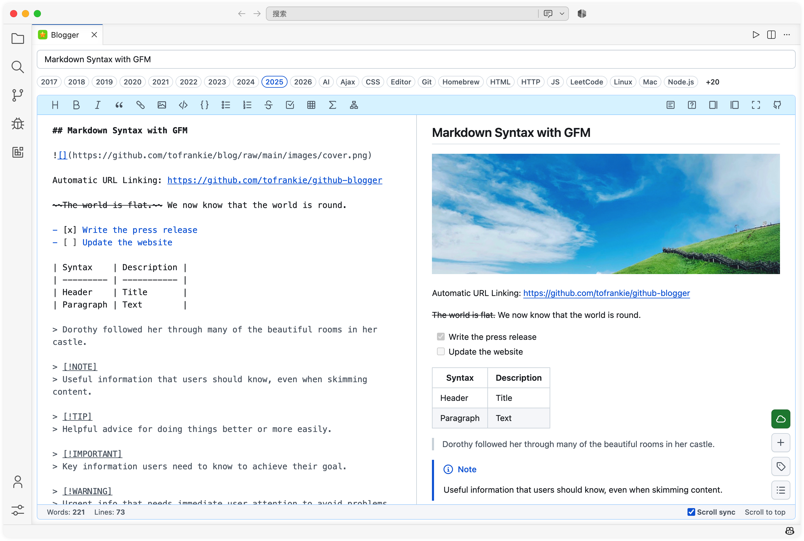
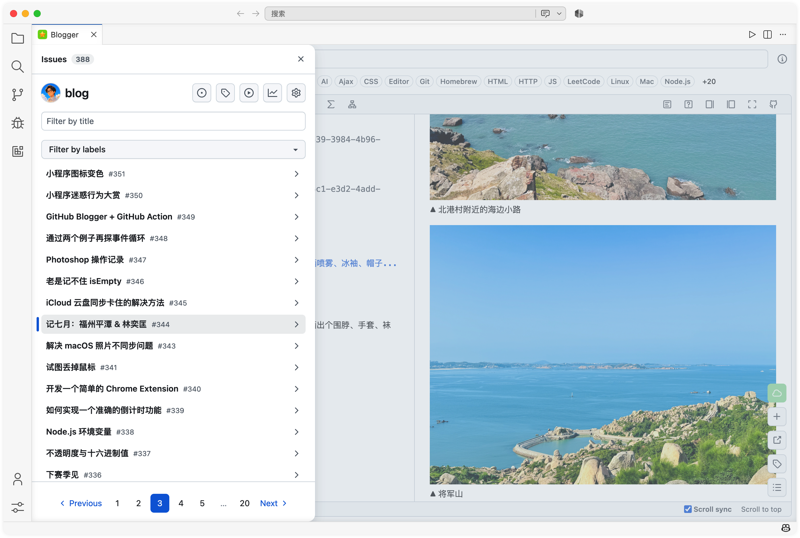
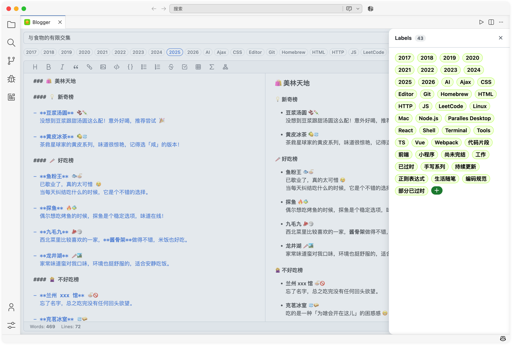

# GitHub Blogger

[
](https://marketplace.visualstudio.com/items?itemName=frankie.github-blogger) [
](https://open-vsx.org/extension/frankie/github-blogger)

[English](README.md) | 中文

**GitHub Blogger** 是一款基于 VS Code 的扩展，通过 GitHub issue 编写和管理博客文章。支持 Markdown 编辑、实时预览和无缝发布，这一切都由 GitHub 驱动。

## ✨ 功能特性

- 通过 GitHub issue 管理和发布博客文章
- 原生 GitHub 交互体验
- 支持实时预览和插件的 Markdown 编辑器（数学公式、Mermaid 图表等）
- 图片存储在的仓库，通过 jsDelivr CDN 提供显示服务
- 所有内容和编辑记录直接存储在你的仓库中

## 🚀 快速开始

1. 从 [VS Code Marketplace](https://marketplace.visualstudio.com/items?itemName=frankie.github-blogger) 或 [Open VSX](https://open-vsx.org/extension/frankie/github-blogger) 安装
2. 生成你的 [GitHub Personal Access Token (classic)](https://github.com/settings/tokens)
3. 在命令面板输入 `Configure GitHub Blogger` 完成必要配置（命令面板快捷键 `Cmd + Shift + P` / `Ctrl + Shift + P`）
4. 在命令面板输入 `Open GitHub Blogger` 打开编辑器，开始写作！

配置示例：

```json
{
  "github-blogger.token": "your-github-token",
  "github-blogger.user": "your-github-username",
  "github-blogger.repo": "your-github-repo",
  "github-blogger.branch": "main"
}
```

## ⚠️ 说明

- **你的仓库必须为公开仓库**，以便 jsDelivr CDN 正常工作（[原因](https://github.com/jsdelivr/jsdelivr/issues/18243#issuecomment-857512289)）
- 你可以使用任何现有仓库或创建新仓库
- 文章和图片保存在 `archives` 和 `images` 文件夹中
- 工作分支通过 `github-blogger.branch` 设置。请确保该分支存在，否则归档和上传可能失败

## 🙏 致谢

本项目基于开源社区的工作构建和启发，包括但不限于：

- [Aaronphy/Blogger](https://github.com/Aaronphy/Blogger) – 项目灵感来源
- [@octokit/core](https://github.com/octokit/core.js) – GitHub 官方 SDK
- [@primer/react](https://primer.style/react) – GitHub 官方 UI 组件
- [@tomjs/vite-plugin-vscode](https://github.com/tomjs/vite-plugin-vscode) – VS Code 扩展工具
- [bytemd](https://github.com/bytedance/bytemd) – Markdown 编辑器
- [jsDelivr](https://www.jsdelivr.com/?docs=gh) – 免费 CDN 服务

## 📷 截图

  

## 📚 相关项目

- [github-issue-toc](https://github.com/tofrankie/github-issue-toc) – 为 GitHub issue 生成目录

## 📝 License

MIT
