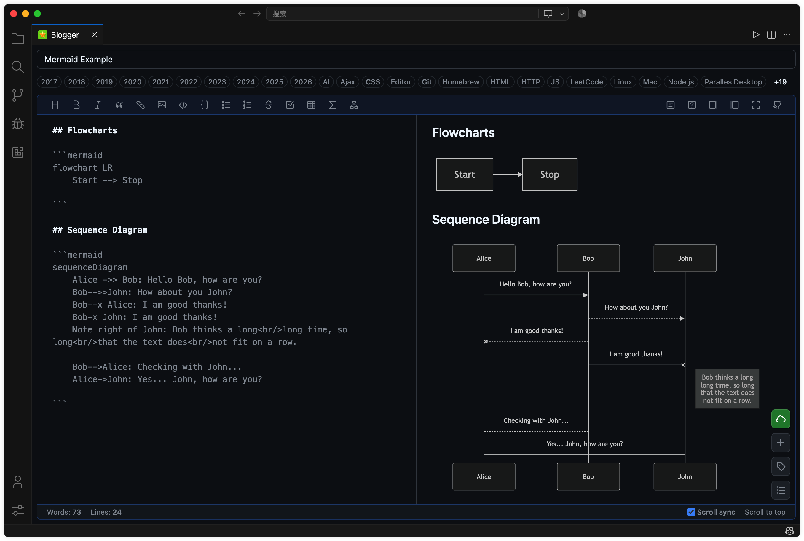
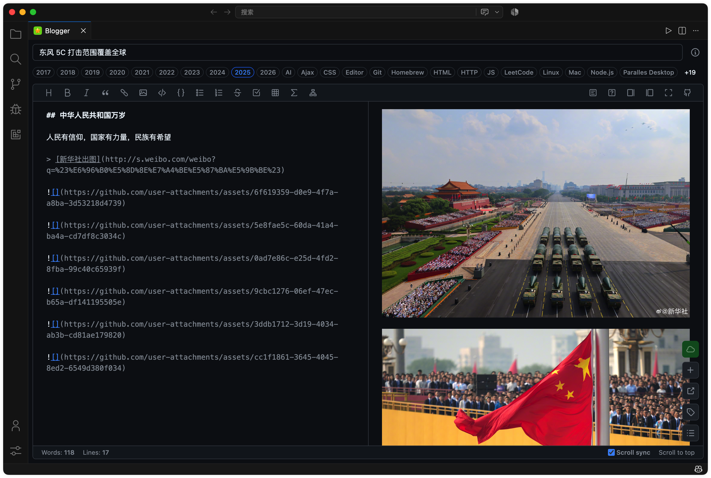
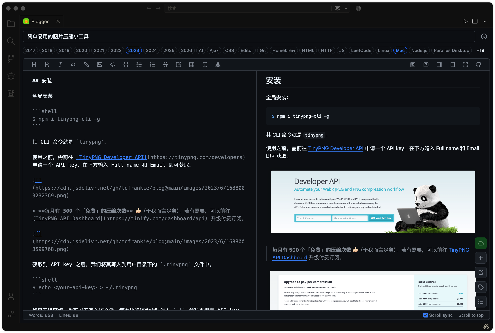

# GitHub Blogger

[](https://marketplace.visualstudio.com/items?itemName=frankie.github-blogger) [
](https://open-vsx.org/extension/frankie/github-blogger)

English | [中文](README.zh_CN.md)

**GitHub Blogger** is a VS Code WebView extension for managing GitHub Issues as blog posts. It supports rich Markdown rendering, live preview, and convenient post editing and publishing. This extension works with all VSCodium-based editors, such as Cursor, TRAE, Kiro, Google Antigravity, and more.

## Features

- Manage and publish blog posts via the GitHub API, with text, images, and edit history (Git commits) stored in your blog repository
- A GitHub-native writing experience with support for common workflows such as Issues and Labels
- Light and dark modes, with editor appearance you can switch as needed
- Live preview and rich Markdown rendering, including GitHub Flavored Markdown, math formulas, Mermaid Diagram, GitHub Alerts, and more
- Built-in free image hosting: images are stored in your blog repository and accelerated via jsDelivr CDN

> [!IMPORTANT]
> **Your blog repository must be public** for jsDelivr CDN to work ([why](https://github.com/jsdelivr/jsdelivr/issues/18243#issuecomment-857512289), [set visibility](https://docs.github.com/en/repositories/managing-your-repositorys-settings-and-features/managing-repository-settings/setting-repository-visibility))

## Quick Start

1. Create a [GitHub](https://docs.github.com/en/get-started/start-your-journey/creating-an-account-on-github#signing-up-for-a-new-personal-account) account (skip if you already have one)
2. Create a [public repository](https://docs.github.com/en/repositories/creating-and-managing-repositories/creating-a-new-repository#creating-a-new-repository-from-the-web-ui) (skip if you want to use an existing repository)
3. Generate a [GitHub Personal Access Token (classic)](https://github.com/settings/tokens) and select at least the `public_repo` scope
4. Install the GitHub Blogger extension from the [Visual Studio Marketplace](https://marketplace.visualstudio.com/items?itemName=frankie.github-blogger) or [Open VSX](https://open-vsx.org/extension/frankie/github-blogger)
5. Open the command palette (Cmd + Shift + P / Ctrl + Shift + P), search for `Configure GitHub Blogger` to set up
6. Then run `Open GitHub Blogger` and start writing

## Update Configuration

To update extension settings, run `Configure GitHub Blogger` on command palette or edit your `settings.json`.

Example:

```json
{
  "github-blogger.token": "your-github-token",
  "github-blogger.user": "your-github-username",
  "github-blogger.repo": "your-github-repo",
  "github-blogger.branch": "main",
  "github-blogger.color-mode": "light"
}
```

## GitHub PAT

This extension requires a [GitHub Personal Access Token (classic)](https://github.com/settings/tokens) with at least one of the following scopes:

- `public_repo` - minimum required scope when using a public repository (issues, labels, contents/git, etc.)
- `repo` - only needed if you plan to access or create a private repository

## Notes

- Posts and images are stored under `archives` and `images` in your blog repository
- The working branch is configured via `github-blogger.branch`, with `main` as the default. In most cases, you do not need to change it. If the branch does not exist, post/image storage may fail, and images in posts may not display correctly

## Previews


<details>
<summary>Dark Mode</summary>





</details>

## Acknowledgements

This project is built upon and inspired by the open-source community, including:

- [Aaronphy/Blogger](https://github.com/Aaronphy/Blogger) Project inspiration
- [@octokit/core](https://github.com/octokit/core.js) GitHub's official SDKs
- [@primer/react](https://primer.style/react) GitHub's official UI components
- [@tomjs/vite-plugin-vscode](https://github.com/tomjs/vite-plugin-vscode) VS Code extension tooling
- [bytemd](https://github.com/pd4d10/bytemd) Markdown editor
- [jsDelivr](https://www.jsdelivr.com/?docs=gh) Free CDN service

## Related Projects

- [github-issue-toc](https://github.com/tofrankie/github-issue-toc) Generate a table of contents for GitHub Issues

## License

MIT License © [Frankie](https://github.com/tofrankie)
